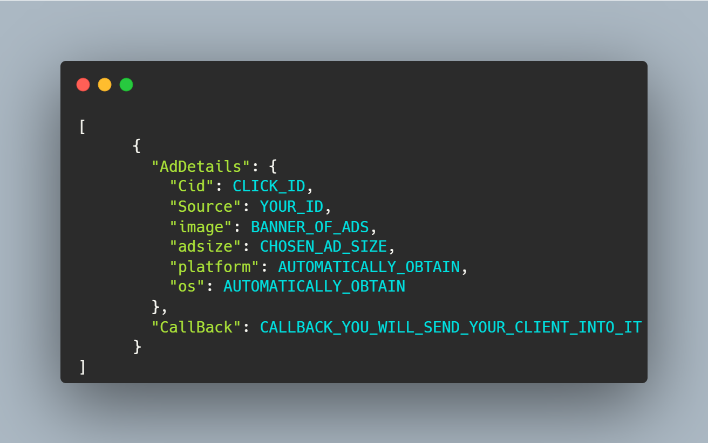

# DaartAds PHP library
You can use this library to access the DaartAds APIs.

## Requirements
- PHP >= 7.3
- Your server has to have CURL enabled. [(How to enable CURL)](https://www.geeksforgeeks.org/how-to-enable-curl-in-php/)

## Installation
```shell
composer require aljvdi/DaartAds
```

## Usage
```php
require __DIR__ . "/../vendor/autoload.php";

// Your api key needs to be initialised here.
$DaartADS = new \javadi\DaartAgency\DaartAds(YOUR_API_KEY);

// For Get ADS:
$ads = $DaartADS->GetADS(CHOOSING_AD_SIZE);

```
- You will receive a list with all the information for the show ADS (Include _AdDetails_ & _CallBack_ Link)

  

- For whatever purpose, you may utilise the static AdCallBack() function to construct your own callback:
```php
$DaartADS::AdCallBack(CLICK_ID,YOUR_ID,CHOSEN_AD_SIZE);
```

### A complete demo is available at ```Demo/demo.php```